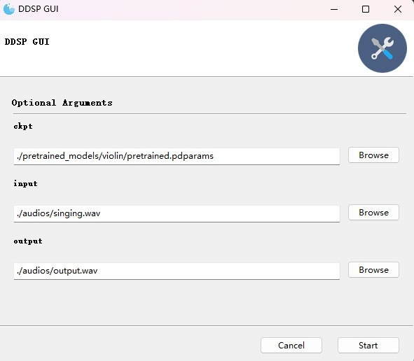

# Paddle-DDSP
## Introduction
* A DDSP model implementation of PaddlePaddle version, refer to [acids-ircam/ddsp_pytorch](https://github.com/acids-ircam/ddsp_pytorch) and [magenta/ddsp](https://github.com/magenta/ddsp) repos

* This is a relatively simple project, the effect of timbre conversion is not very good

## Usage
* Command version:

    ```bash
    $ python predict.py \
        [-c ckpt](optional) \
        [-i input audio (*.wav)](optional) \
        [-o output audio (*.wav)](optional)
    ```

* GUI version:

    ```bash
    $ python predict_gui.py
    ```

    